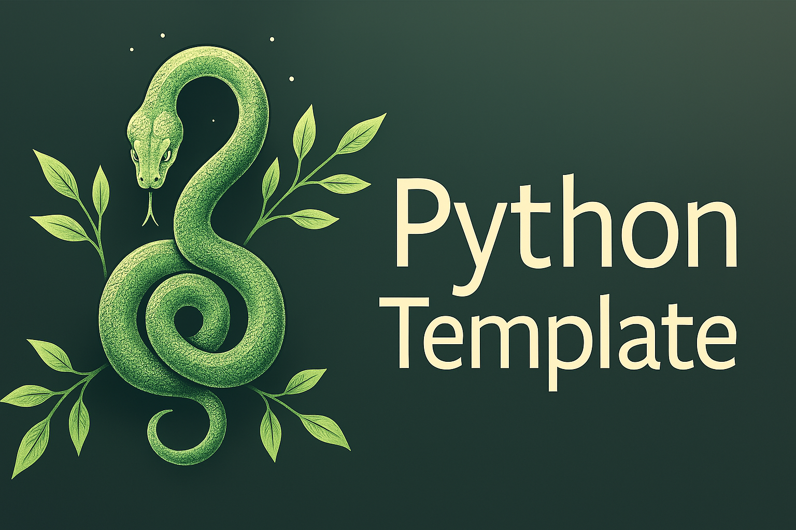

# Python Template

My personal Python project template to provide a streamlined starting point for Python projects.

## Features

- **Dependency Management**: Uses [`uv`](https://github.com/astral-sh/uv) for fast dependency installation based on `pyproject.toml`.
- **Static Analysis**: Integrated with:
  - [Ruff](https://docs.astral.sh/ruff/): A fast Python linter and formatter.
  - [Pytest](https://pytest.org/): A framework for running unit tests.
- **DevContainer Support**: Preconfigured [DevContainer](https://containers.dev/) for a seamless development environment using Docker and VSCode.

---

## Requirements

- Python 3.10 or higher.
- [`uv`](https://github.com/astral-sh/uv) for installing dependencies.
- [Docker](https://www.docker.com/) for containerized development (optional but recommended).

---

## Setup Instructions


### 1. Clone the Repository
```bash
git clone https://github.com/tctibbs/template_python.git
cd template_python
```


### 2. Set Up the Development Environment

Choose one of the following options:

### Option A: DevContainer
	1.	Ensure you have Docker and VSCode installed with the Remote - Containers extension.
	2.	Open the project in VSCode. It will automatically prompt you to open the folder in a container.
	3.	The DevContainer includes:
        •	Pre-installed tools like uv, ruff, and pytest.
        •	Python 3.13-rc Docker image.

Option B: Manual Setup with uv

If you’re running locally:
```bash
pip install uv
uv pip install ".[dev]"
```


## Usage

Run Linters

``` bash
ruff .
```

Run Tests

``` bash
pytest
```


## Common Errors

- **GPG Error / Not Signed**: Can be caused by insufficient disk space. Free up space and retry.

## License

This project is licensed under the MIT License. See the LICENSE file for details.
